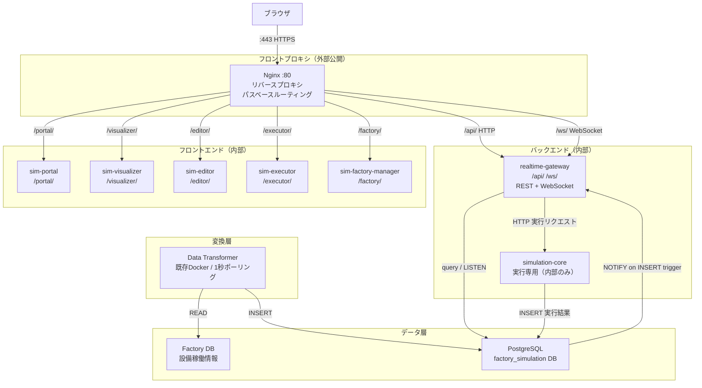
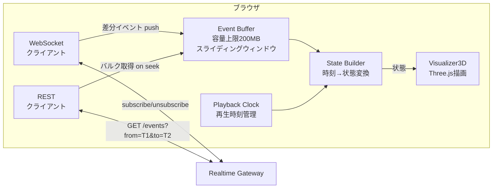
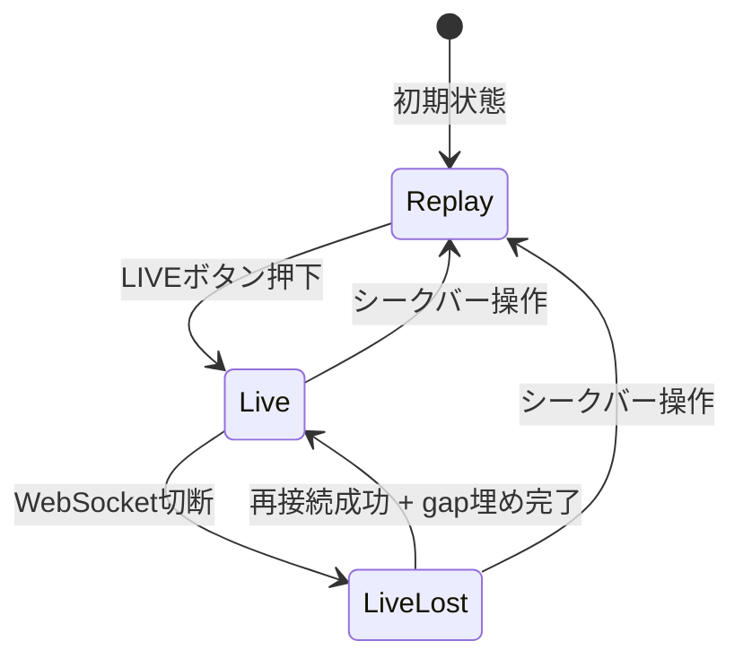
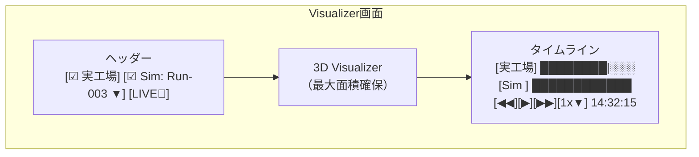
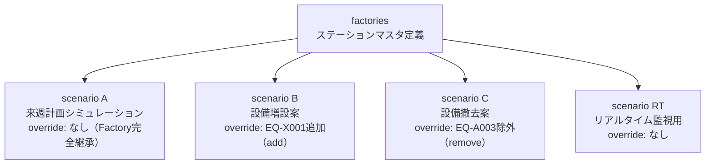
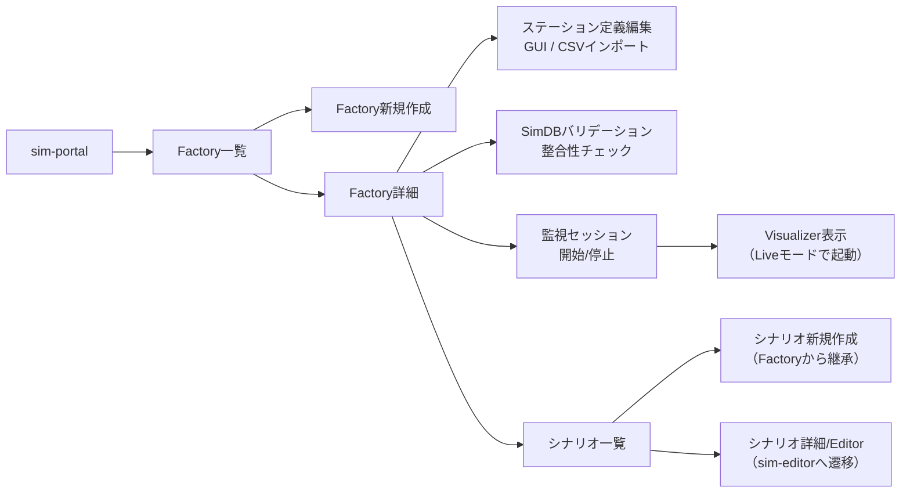

# 設計: Visualizerリアルタイム機能拡張

## 1. 全体アーキテクチャ



### Nginx パスルーティング

| パス | 転送先 | 備考 |
|---|---|---|
| `/` | `/portal/` へリダイレクト | |
| `/portal/` | sim-portal | 静的ファイル |
| `/visualizer/` | sim-visualizer | 静的ファイル |
| `/editor/` | sim-editor | 静的ファイル |
| `/executor/` | sim-executor | 静的ファイル |
| `/factory/` | sim-factory-manager | 静的ファイル |
| `/api/` | realtime-gateway:8090 | REST API |
| `/ws` | realtime-gateway:8090 | WebSocket（Upgrade対応） |

### HTTPS / TLS 設定

自己署名証明書によるHTTPS対応。開発/社内利用を前提とする。

**証明書生成（Docker起動時に自動生成）:**

```bash
openssl req -x509 -nodes -days 3650 \
  -newkey rsa:2048 \
  -keyout /etc/nginx/ssl/server.key \
  -out /etc/nginx/ssl/server.crt \
  -subj "/CN=factory-sim.local" \
  -addext "subjectAltName=DNS:factory-sim.local,DNS:localhost,IP:127.0.0.1"
```

**Nginx TLS設定:**

```nginx
server {
    listen 80;
    return 301 https://$host$request_uri;
}

server {
    listen 443 ssl;
    server_name factory-sim.local localhost;

    ssl_certificate     /etc/nginx/ssl/server.crt;
    ssl_certificate_key /etc/nginx/ssl/server.key;
    ssl_protocols       TLSv1.2 TLSv1.3;
    ssl_ciphers         HIGH:!aNULL:!MD5;

    # パスルーティング（下記参照）
    ...
}
```

**WebSocket over TLS (wss://):**

ブラウザからの接続は `wss://factory-sim.local/ws/live` となる。
nginx-proxy がTLS終端し、バックエンド（realtime-gateway）へは平文HTTPで転送。

### WebSocket プロキシ設定ポイント

```nginx
location /ws {
    proxy_pass http://realtime-gateway:8090;
    proxy_http_version 1.1;
    proxy_set_header Upgrade $http_upgrade;
    proxy_set_header Connection "upgrade";
    proxy_set_header Host $host;
    proxy_set_header X-Forwarded-Proto $scheme;
    proxy_read_timeout 3600s;
}
```

## 2. サービス構成

| サービス | 役割 | 外部ポート | 内部ポート | 変更種別 |
|---|---|---|---|---|
| `nginx-proxy` | リバースプロキシ専用 (HTTPS/TLS終端) | **443, 80** | 443, 80 | **新規** |
| `simulation-core` | シミュレーション実行専用エンジン | なし | 8080 | 変更（API削減・外部非公開化） |
| `sim-visualizer` | 3D可視化フロントエンド | なし | 80 | 変更（Live機能追加・API proxy削除） |
| `sim-editor` | シナリオエディタ | なし | 80 | 変更（Factory/テンプレート対応・API proxy削除） |
| `sim-executor` | 実行管理フロントエンド | なし | 80 | 変更（API proxy削除） |
| `sim-portal` | 統合管理ポータル（静的HTMLのみ） | なし | 80 | **変更（プロキシ機能削除、静的配信専用化）** |
| `realtime-gateway` | REST API + WebSocket + 実行管理 | なし | 8090 | **新規** |
| `sim-factory-manager` | Factory管理フロントエンド | なし | 80 | **新規** |
| `postgres` | データベース | なし | 5432 | 変更（スキーマ拡張） |

**廃止サービス:**

| サービス | 理由 |
|---|---|
| `sim-executor-backend` | 実行管理API機能をRealtime Gatewayに統合。execution_configs管理、実行トリガーもGateway経由に |

**外部に公開するポートは `:443`（HTTPS）と `:80`（HTTPSへリダイレクト）のみ。** 各サービスはDockerの内部ネットワーク内でのみ通信する。TLS終端はnginx-proxyが担い、内部通信は平文HTTP。

### nginx-proxyとsim-portalの分離

**Before（現状）:**
- sim-portalがフロントプロキシを兼任（80/443公開、TLS終端、パスルーティング、ポータルHTML配信すべて1コンテナ）

**After:**
- `nginx-proxy`: プロキシ専用（TLS終端 + パスルーティング + WebSocketプロキシ）。HTMLを一切持たない
- `sim-portal`: 他のフロントエンドと同じ構造（Nginx静的ファイル配信のみ）。`/portal/`パスでnginx-proxyからルーティングされる

```
nginx-proxy (プロキシ専用)
├── nginx.conf        ← ルーティング + TLS設定のみ
├── ssl/              ← 証明書マウント
└── Dockerfile        ← nginx:alpine ベース

sim-portal (静的HTML専用)
├── html/index.html   ← ポータル画面
├── nginx.conf        ← 静的配信のみ（try_files）
└── Dockerfile        ← nginx:alpine ベース
```

### 各フロントエンドサービスのNginx変更点

**Before:** 静的ファイル配信 + `/api/` を simulation-core へプロキシ  
**After:** 静的ファイル配信のみ（APIプロキシ設定を削除）

全フロントエンド（sim-portal含む）が同一構造になる:
```nginx
server {
    listen 80;
    root /usr/share/nginx/html;
    index index.html;
    location / {
        try_files $uri $uri/ /index.html;
    }
}
```

### simulation-core の役割変更

**Before:** REST APIサーバー + シミュレーション実行  
**After:** シミュレーション実行専用（内部HTTP APIのみ）

- Realtime GatewayからHTTPで実行リクエストを受け付ける
- 将来的にコンテナ単位スケーリング対応（1シミュレーション = 1コンテナ）
- 疎結合を維持し、Gatewayとは独立してスケール可能

## 3. データベース設計

### 3.0 設計方針

**単一DB統合方式を採用する。**

- 既存の「1シミュレーション = 1 WDH DB」方式を廃止
- 全データを1つのPostgreSQLデータベース（`factory_simulation`）に統合
- `data_source_id`カラムによる論理分離 + パーティショニングで性能確保
- データ形式はWDHスキーマ（`item_movement`, `machine_signal`等）に統一
- 既存の`work_events`/`station_status_logs`/`simulation_runs`は廃止

```
[単一DB: factory_simulation]
├── 管理テーブル群
│   ├── factories           ← 工場定義
│   ├── factory_stations    ← ステーションマスタ
│   ├── factory_connections ← 接続マスタ
│   ├── scenarios           ← シナリオ定義（設計図）
│   ├── scenario_stations   ← シナリオのオーバーライド
│   ├── scenario_connections
│   ├── data_sources        ← 実行/監視セッション管理（メタ）
│   └── execution_configs   ← 実行設定
│
├── WDHマスタ（実行時スナップショット、data_source_id付き）
│   ├── location_master     ← シナリオ解決済みのレイアウトスナップショット
│   ├── connection_master
│   ├── machine_master
│   └── item_master
│
└── WDHログ（data_source_id付き、パーティション対象）
    ├── item_movement       ← ワーク移動ログ
    ├── item_lineage        ← ワーク構成変化
    ├── item_status         ← ワーク品質判定
    ├── item_expiry         ← ワーク有効期限
    ├── machine_signal      ← 設備インターロック信号
    ├── machine_status      ← 設備ビット状態
    └── system_error        ← 不正入力記録
```

**VisualizerはWDHテーブルから直接読み取る。Data TransformerもWDHテーブルに直接INSERTする。**

### 3.1 管理テーブル

```sql
-- Factory（工場定義）
CREATE TABLE factories (
    id UUID PRIMARY KEY DEFAULT gen_random_uuid(),
    name TEXT NOT NULL,
    description TEXT,
    factory_db_host TEXT,
    factory_db_port INTEGER DEFAULT 5432,
    factory_db_name TEXT,
    factory_db_user TEXT,
    factory_db_password TEXT,
    created_at TIMESTAMPTZ NOT NULL DEFAULT NOW(),
    updated_at TIMESTAMPTZ NOT NULL DEFAULT NOW()
);

-- Factory内ステーション定義（マスタ）
CREATE TABLE factory_stations (
    id SERIAL PRIMARY KEY,
    factory_id UUID NOT NULL REFERENCES factories(id) ON DELETE CASCADE,
    station_id TEXT NOT NULL,       -- 'EQ-A001.01' 形式
    equipment_id TEXT NOT NULL,     -- 'EQ-A001'
    seq_number INTEGER NOT NULL,    -- 連番 1, 2, 3...
    name TEXT,                      -- フレンドリーネーム
    station_type TEXT NOT NULL,     -- source/processing/drain/merge/split/moduler/entry/exit
    position_x REAL DEFAULT 0,
    position_y REAL DEFAULT 0,
    config JSONB DEFAULT '{}',
    UNIQUE(factory_id, station_id)
);

-- Factory内接続定義（マスタ）
CREATE TABLE factory_connections (
    id SERIAL PRIMARY KEY,
    factory_id UUID NOT NULL REFERENCES factories(id) ON DELETE CASCADE,
    from_station TEXT NOT NULL,
    to_station TEXT NOT NULL,
    condition TEXT NOT NULL DEFAULT 'default',
    from_port_index INTEGER DEFAULT 0,
    to_port_index INTEGER DEFAULT 0
);

-- シナリオ（既存テーブル拡張）
ALTER TABLE scenarios ADD COLUMN factory_id UUID REFERENCES factories(id);
ALTER TABLE scenarios ADD COLUMN scenario_type TEXT NOT NULL DEFAULT 'simulation'
    CHECK (scenario_type IN ('simulation', 'factory_realtime'));

-- シナリオステーション（既存テーブル拡張: オーバーライド方式）
ALTER TABLE scenario_stations ADD COLUMN override_type TEXT NOT NULL DEFAULT 'add'
    CHECK (override_type IN ('add', 'modify', 'remove'));

-- データソース統合管理（simulation / realtime 両方）
CREATE TABLE data_sources (
    id UUID PRIMARY KEY DEFAULT gen_random_uuid(),
    source_type TEXT NOT NULL CHECK (source_type IN ('simulation', 'realtime')),
    scenario_id TEXT NOT NULL REFERENCES scenarios(id),
    friendly_name TEXT,
    started_at TIMESTAMPTZ NOT NULL DEFAULT NOW(),
    ended_at TIMESTAMPTZ,           -- NULLなら稼働中（realtimeのみ）
    config JSONB DEFAULT '{}',      -- simulation: 実行条件, realtime: 接続メタ情報
    created_at TIMESTAMPTZ NOT NULL DEFAULT NOW()
);

-- 実行設定（既存テーブル変更: simulation_id → data_source_id）
ALTER TABLE execution_configs ADD COLUMN data_source_id UUID REFERENCES data_sources(id);
ALTER TABLE execution_configs DROP COLUMN simulation_id;
```

### 3.2 WDHテーブル（data_source_id付きで統合）

既存WDHスキーマに`data_source_id`を追加して論理分離する。
タイムスタンプは全てTIMESTAMPTZ（絶対時刻）。

```sql
-- WDHマスタ: 実行時のレイアウトスナップショット
CREATE TABLE location_master (
    id BIGSERIAL PRIMARY KEY,
    data_source_id UUID NOT NULL REFERENCES data_sources(id),
    name VARCHAR NOT NULL,
    station_type VARCHAR,
    parent_location_id BIGINT,
    pos_x DOUBLE PRECISION,
    pos_y DOUBLE PRECISION,
    pos_z DOUBLE PRECISION,
    max_capacity BIGINT,
    processing_time DOUBLE PRECISION,
    merge_count SMALLINT,
    split_count SMALLINT
);

CREATE TABLE connection_master (
    id BIGSERIAL PRIMARY KEY,
    data_source_id UUID NOT NULL REFERENCES data_sources(id),
    from_location_id BIGINT NOT NULL,
    to_location_id BIGINT NOT NULL,
    from_port_index SMALLINT,
    to_port_index SMALLINT,
    condition VARCHAR
);

CREATE TABLE machine_master (
    id VARCHAR(50) NOT NULL,
    data_source_id UUID NOT NULL REFERENCES data_sources(id),
    name VARCHAR(50) NOT NULL,
    location_id BIGINT,
    cycle_time DOUBLE PRECISION,
    PRIMARY KEY (id, data_source_id)
);

CREATE TABLE item_master (
    id VARCHAR NOT NULL,
    data_source_id UUID NOT NULL REFERENCES data_sources(id),
    item_type VARCHAR NOT NULL,
    PRIMARY KEY (id, data_source_id)
);

-- WDHログ: パーティション対象
CREATE TABLE item_movement (
    event_time TIMESTAMPTZ NOT NULL,
    data_source_id UUID NOT NULL,
    item_id VARCHAR NOT NULL,
    from_location_id BIGINT,
    to_location_id BIGINT,
    movement_type VARCHAR NOT NULL,
    port_index SMALLINT
) PARTITION BY RANGE (event_time);

CREATE TABLE item_lineage (
    event_time TIMESTAMPTZ NOT NULL,
    data_source_id UUID NOT NULL,
    input_item_id VARCHAR,
    output_item_id VARCHAR,
    location_id BIGINT NOT NULL
) PARTITION BY RANGE (event_time);

CREATE TABLE item_status (
    event_time TIMESTAMPTZ NOT NULL,
    data_source_id UUID NOT NULL,
    item_id VARCHAR NOT NULL,
    location_id BIGINT,
    status SMALLINT
) PARTITION BY RANGE (event_time);

CREATE TABLE item_expiry (
    data_source_id UUID NOT NULL,
    item_id VARCHAR NOT NULL,
    enabled_at TIMESTAMPTZ NOT NULL,
    destination_location_id BIGINT NOT NULL,
    expires_at TIMESTAMPTZ NOT NULL,
    expiry_location_id BIGINT NOT NULL
);

CREATE TABLE machine_signal (
    event_time TIMESTAMPTZ NOT NULL,
    data_source_id UUID NOT NULL,
    machine_id VARCHAR(50) NOT NULL,
    signal_name VARCHAR NOT NULL,
    value BOOLEAN NOT NULL,
    old_value BOOLEAN,
    rule_id VARCHAR
) PARTITION BY RANGE (event_time);

CREATE TABLE machine_status (
    event_time TIMESTAMPTZ NOT NULL,
    data_source_id UUID NOT NULL,
    machine_id VARCHAR(50) NOT NULL,
    register_index SMALLINT NOT NULL,
    bit_index SMALLINT NOT NULL,
    bit_value BIT(1) NOT NULL
) PARTITION BY RANGE (event_time);

CREATE TABLE system_error (
    id BIGSERIAL PRIMARY KEY,
    data_source_id UUID NOT NULL REFERENCES data_sources(id),
    db_name VARCHAR NOT NULL,
    table_name VARCHAR NOT NULL,
    record_no BIGINT NOT NULL,
    details TEXT,
    created_at TIMESTAMPTZ NOT NULL DEFAULT CURRENT_TIMESTAMP,
    notified_at TIMESTAMPTZ,
    UNIQUE (data_source_id, db_name, table_name, record_no)
);
```

### 3.3 パーティショニング

ログテーブル（`item_movement`, `machine_signal`, `item_lineage`, `item_status`, `machine_status`）を月次パーティションで管理。

```sql
-- 月次パーティション（cronまたはpg_partmanで自動作成）
CREATE TABLE item_movement_2026_05 PARTITION OF item_movement
    FOR VALUES FROM ('2026-05-01') TO ('2026-06-01');
CREATE TABLE item_movement_2026_06 PARTITION OF item_movement
    FOR VALUES FROM ('2026-06-01') TO ('2026-07-01');

CREATE TABLE machine_signal_2026_05 PARTITION OF machine_signal
    FOR VALUES FROM ('2026-05-01') TO ('2026-06-01');
-- 他のログテーブルも同様

-- インデックス（各パーティションに自動適用）
CREATE INDEX ON item_movement (data_source_id, event_time);
CREATE INDEX ON item_movement (event_time);
CREATE INDEX ON machine_signal (data_source_id, event_time);
CREATE INDEX ON machine_signal (event_time);
```

**データ保持ポリシー:**
- シミュレーション結果: 無期限保持（容量が問題になったら古いものを手動削除）
- リアルタイムデータ: 3ヶ月保持、それ以前のパーティションはDROP

### 3.4 NOTIFY トリガー

```sql
CREATE OR REPLACE FUNCTION notify_new_event() RETURNS TRIGGER AS $$
BEGIN
    PERFORM pg_notify(
        'events_' || NEW.data_source_id::text,
        json_build_object(
            'table', TG_TABLE_NAME,
            'event_time', NEW.event_time,
            'item_id', COALESCE(NEW.item_id, ''),
            'from_location_id', NEW.from_location_id,
            'to_location_id', NEW.to_location_id,
            'movement_type', COALESCE(NEW.movement_type, ''),
            'port_index', NEW.port_index
        )::text
    );
    RETURN NEW;
END;
$$ LANGUAGE plpgsql;

CREATE OR REPLACE FUNCTION notify_signal_event() RETURNS TRIGGER AS $$
BEGIN
    PERFORM pg_notify(
        'events_' || NEW.data_source_id::text,
        json_build_object(
            'table', TG_TABLE_NAME,
            'event_time', NEW.event_time,
            'machine_id', NEW.machine_id,
            'signal_name', NEW.signal_name,
            'value', NEW.value,
            'old_value', NEW.old_value
        )::text
    );
    RETURN NEW;
END;
$$ LANGUAGE plpgsql;

CREATE TRIGGER item_movement_notify
    AFTER INSERT ON item_movement
    FOR EACH ROW EXECUTE FUNCTION notify_new_event();

CREATE TRIGGER machine_signal_notify
    AFTER INSERT ON machine_signal
    FOR EACH ROW EXECUTE FUNCTION notify_signal_event();
```

**NOTIFYペイロード設計:**
- pg_notifyのペイロード上限は8000バイト。1イベント分のフルデータを含める方式を採用
- GatewayはNOTIFY受信後に再SELECTせず、ペイロードをそのままWebSocketクライアントに転送
- これにより、リアルタイム配信のレイテンシを最小化する

### 3.5 既存テーブルの廃止

以下のテーブルは完全に削除する（破壊的変更）:

| 廃止テーブル | 代替 |
|---|---|
| `simulation_runs` | `data_sources` |
| `work_events` | `item_movement` |
| `station_status_logs` | `machine_signal` |
| `work_lineage` | `item_lineage` |

### 3.6 シナリオ → WDHスナップショットの生成

シミュレーション実行時/リアルタイム監視セッション開始時に、シナリオを解決（Factory継承 + オーバーライド適用）した結果を`location_master`/`connection_master`/`machine_master`に書き込む。

```
シナリオ解決ロジック:
  factory_stations 全件（ベース）
  − scenario_stationsでoverride_type='remove'のもの
  + scenario_stationsでoverride_type='add'のもの
  ※ override_type='modify': factory_stationsの値をscenario_stationsの値で上書き
     ↓
  解決済みデータを location_master に INSERT（data_source_id付き）
```

これにより、Visualizerは常に`location_master`（data_source_id指定）からレイアウトを取得すれば良い。シナリオ管理テーブルを直接読む必要がない。

## 4. Realtime Gateway 設計

### 4.1 REST API エンドポイント

| Method | Path | 説明 |
|---|---|---|
| | **Factory管理** | |
| GET | `/api/factories` | Factory一覧 |
| POST | `/api/factories` | Factory作成 |
| GET | `/api/factories/{id}` | Factory詳細（station/connection含む） |
| PUT | `/api/factories/{id}` | Factory更新 |
| GET | `/api/factories/{id}/stations` | ステーション一覧 |
| POST | `/api/factories/{id}/stations/import-csv` | CSVインポート |
| | **シナリオ管理** | |
| GET | `/api/scenarios` | シナリオ一覧 |
| POST | `/api/scenarios` | シナリオ作成 |
| GET | `/api/scenarios/{id}` | シナリオ詳細（Factory継承解決済み） |
| PUT | `/api/scenarios/{id}` | シナリオ更新 |
| | **データソース管理** | |
| GET | `/api/data-sources` | データソース一覧 |
| POST | `/api/data-sources` | データソース作成（監視セッション開始） |
| GET | `/api/data-sources/{id}` | データソース詳細 |
| PATCH | `/api/data-sources/{id}` | 更新（ended_at設定 = 監視停止） |
| GET | `/api/data-sources/{id}/events` | イベント取得（from/to クエリパラメータ） |
| GET | `/api/data-sources/{id}/layout` | レイアウト取得（location_master/connection_master） |
| | **シミュレーション実行（旧sim-executor-backend統合）** | |
| POST | `/api/executions` | シミュレーション実行リクエスト（→simulation-coreに転送） |
| GET | `/api/executions` | 実行履歴一覧 |
| GET | `/api/executions/{id}` | 実行詳細・ステータス |
| DELETE | `/api/executions/{id}` | 実行キャンセル |

### 4.2 WebSocket

```
WS /ws/live

クライアント → サーバー（購読開始）:
{
  "type": "subscribe",
  "data_source_id": "uuid"
}

クライアント → サーバー（購読停止）:
{
  "type": "unsubscribe"
}

サーバー → クライアント（work_event）:
{
  "type": "event",
  "data": {
    "table": "work_events",
    "timestamp": "2026-05-07T14:32:01.500Z",
    "station_id": "EQ-A001.02",
    "work_id": "W-00451",
    "event_type": "WorkArrived",
    "port_index": 0,
    "work_type": "TypeA",
    "quality_status": "OK"
  }
}

サーバー → クライアント（station_status）:
{
  "type": "event",
  "data": {
    "table": "station_status_logs",
    "timestamp": "2026-05-07T14:32:01.500Z",
    "station_id": "EQ-A001.02",
    "status_type": "signal_change",
    "signal_name": "carry_in_allowed",
    "value": true
  }
}

サーバー → クライアント（死活監視）:
{
  "type": "heartbeat",
  "server_time": "2026-05-07T14:32:05.000Z"
}
```

### 4.3 Fan-out 設計

- PostgreSQL LISTEN接続は1本（Gatewayプロセス内で共有）
- クライアント接続はgoroutine + `sync.Map` で管理
- チャネル: `events_{data_source_id}` でデータソース単位にNOTIFY
- 接続数上限: 工場監視用途では数十接続程度を想定

## 5. Visualizer 設計

### 5.1 データフロー



### 5.2 Event Buffer

| 項目 | 仕様 |
|---|---|
| 容量上限 | 200MB（設定変更可能） |
| ウィンドウ | 再生位置を中心に保持、古い方から破棄 |
| Live時 | 最新側を優先保持 |
| シーク時 | バッファ範囲外ならREST取得 + ローディング表示 |
| 遅延イベント | 1〜2秒以内なら「現在時刻の状態に追加」で処理 |
| インデックス | タイムスタンプでソート済み、バイナリサーチ対応 |

### 5.3 表示モード



| モード | 実工場データ | シミュレーションデータ | シークバー |
|---|---|---|---|
| **Replay** | 指定時刻の状態表示 | 指定時刻の状態表示 | 自由移動 |
| **Live** | 最新状態に追従 | 実工場と同じ時刻を表示 | 中央固定・時間軸が流れる |
| **LiveLost** | 最後の既知状態をグレーアウト表示 | 継続再生 | 自由移動に移行 |

### 5.4 2レイヤー描画

| レイヤー | 表示色 | 透明度 | 設定 |
|---|---|---|---|
| 実工場データ | デフォルト設定色 | 不透明 | ユーザー設定可 |
| シミュレーションデータ | デフォルト半透明色 | 50%透明 | ユーザー設定可 |

### 5.5 UIレイアウト



### 5.6 WebSocket切断時のリカバリ

```
1. 切断検知（heartbeat途絶 or onclose）
2. モードを LiveLost に変更
3. exponential backoff でリトライ（1s → 2s → 4s → ... → 30s上限）
4. 再接続成功
5. REST GET /events?from=切断時刻&to=現在時刻 でgap埋め
6. Bufferに追加
7. Live モードに復帰
```

## 6. Factory/シナリオ継承設計

### 6.1 継承+オーバーライド



### 6.2 シナリオ解決ロジック

```
最終ステーション一覧 =
    factory_stations 全件（ベース）
    − scenario_stationsでoverride_type='remove'のもの
    + scenario_stationsでoverride_type='add'のもの
    ※ override_type='modify': factory_stationsの値をscenario_stationsの値で上書き

接続定義も同様にfactory_connectionsをベースとしてオーバーライド
```

## 7. バッファコンベア設計

### 7.1 Modulerステーションとして実現

バッファコンベアは `station_type='moduler'` として定義し、内部にN個のスロットを持つ。

```
Moduler "EQ-B001" (バッファコンベア, capacity=100)
内部構造:
  entry → slot-01 → slot-02 → ... → slot-N → exit
  各slot: station_type='processing', processingTime=搬送時間
```

**bufferCapacity属性は廃止。** 容量は内部スロット数で表現する。

### 7.2 テンプレート機能

シナリオエディタでバッファコンベアを配置する際、テンプレートから生成可能。

**入力パラメータ:**

| 項目 | 説明 | 例 |
|---|---|---|
| 設備ID (equipment_id) | コンベアの設備識別子 | `EQ-B001` |
| 名前 | フレンドリーネーム | `1-2工程間バッファ` |
| 搬送方式 | PUSH（押せ押せ）/ PULL（フリーフロー） | `PULL` |
| スロット数 | コンベアの容量 | `100` |
| 搬送時間/スロット | 各スロットのprocessingTime（秒） | `1.0` |
| 配置座標 | エディタ上のX, Y | `300, 200` |

**搬送方式の違い（インターロック条件設定の違いのみ）:**

| 方式 | 搬入可条件 | 搬出可条件 | 挙動 |
|---|---|---|---|
| PUSH（押せ押せ） | Exitの搬出可=true | 次スロットの搬入可=true | 出口に空きがあれば全体が動く。隙間なし |
| PULL（フリーフロー） | 自スロットが空 | 次スロットの搬入可=true | 各ワークが独立に前進。隙間あり |

simulation-coreへの新ロジック追加は不要。既存インターロック機構の条件設定を変えるだけ。

**Moduler config:**

```json
{
  "conveyor_type": "push | pull",
  "slot_count": 100,
  "transport_time_per_slot": 1.0
}
```

**自動生成物:**
- Modulerステーション 1件
- 内部Entryステーション 1件
- 内部Processingステーション N件（搬送方式に応じたインターロック設定付き）
- 内部Exitステーション 1件
- 内部接続 N+1件

### 7.3 3D表示

**俯瞰時（外観表示）:**

| 要素 | 表示 |
|---|---|
| コンベア本体 | 横長の薄い箱体 |
| ゲージバー | 充填率に応じた色変化（空=緑→満=赤） |
| 数値 | 現在数/最大容量（例: 45/100） |
| ドットアニメーション | ワークをドットで表現、流れる方向にアニメーション |

**展開時（クリックで内部ビュー）:**
- 既存のModuler展開機構を流用
- 内部スロットのワーク移動アニメーションを表示

**LOD（Level of Detail）切替:**
- 俯瞰（ズームアウト）: ゲージ + 数値のみ
- 中距離: ゲージ + 数値 + ドット
- 展開: 内部アニメーション

## 8. station_id命名規則

```
形式: {equipment_id}.{seq_number（3桁ゼロ埋め）}

例:
  EQ-A001.001  加工機A 投入口
  EQ-A001.002  加工機A 加工部
  EQ-A001.003  加工機A 排出口
  EQ-B001.001  バッファ1 Entry
  EQ-B001.002  バッファ1 slot-01
  ...
  EQ-B001.101  バッファ1 slot-100
  EQ-B001.102  バッファ1 Exit
```

最大999ステーション/設備をカバー。文字列ソートで番号順が保証される。

factory_stationsテーブルの `name` カラムにフレンドリーネームを格納（既存カラムを活用）。

## 9. Factory管理画面 設計

### 9.1 画面遷移



### 9.2 ステーション定義CSVフォーマット

```csv
station_id,equipment_id,seq_number,name,station_type,position_x,position_y,config
EQ-A001.01,EQ-A001,1,加工機A 投入口,processing,100.0,200.0,"{""processingTime"":10}"
EQ-A001.02,EQ-A001,2,加工機A 加工部,processing,150.0,200.0,"{""processingTime"":30}"
EQ-B001.01,EQ-B001,1,バッファ1,moduler,200.0,200.0,"{""capacity"":100}"
```

### 9.3 SimDBバリデーション

確認項目:
- factory_stationsに定義されたstation_idが、Data TransformerがINSERTするstation_idと一致しているか
- 工場DB接続が正常に行えるか（接続テスト）
- 直近のwork_eventsにfactory_stationsに未登録のstation_idが含まれていないか

## 10. データの時間軸設計

### 10.1 タイムスタンプ統一

全テーブルのtimestampをTIMESTAMPTZ（絶対時刻）に統一する。

| データ種別 | 変換方法 |
|---|---|
| シミュレーション結果 | シミュレーション実行時にbaseTime（実行開始時刻）を設定。相対秒 → `baseTime + 相対秒` で絶対時刻に変換してINSERT |
| リアルタイムデータ | Data Transformerが工場DBから取得した時刻をそのままINSERT |

### 10.2 シミュレーションbaseTime

- シミュレーション実行時に `start_datetime`（いつの時間帯として実行するか）をパラメータで指定
- 例: 「明日の生産計画」→ `start_datetime = 2026-05-08T08:00:00+09:00`
- LiveモードでVisualizerを開くと、実工場データ（現在時刻）とシミュレーション（未来の予測）が時間軸で揃って表示される

## 11. CSVインポート・バリデーション設計

### 11.1 CSVインポート

**エラーハンドリング: 全件ロールバック方式**

1行でもエラーがあれば全件キャンセルし、エラー一覧を返す。

**チェック項目:**

| チェック | 内容 |
|---|---|
| station_id形式 | `{equipment_id}.{3桁数字}` 形式 |
| station_id重複 | 同一Factory内で重複なし |
| station_type値 | source/processing/drain/merge/split/moduler/entry/exit |
| equipment_id整合 | station_idの先頭部分とequipment_idカラムの一致 |
| seq_number整合 | station_idの末尾3桁とseq_numberカラムの一致 |
| 座標 | 数値として有効 |
| config JSON | 有効なJSON形式 |
| 親参照整合性 | Moduler子のparent指定が存在するか |

**レスポンス:**

```json
// 成功
200 OK { "imported": 150, "errors": [] }

// 失敗（全件ロールバック）
400 Bad Request {
  "imported": 0,
  "errors": [
    { "line": 5, "column": "station_type", "message": "Invalid value: 'buffers'" },
    { "line": 12, "column": "station_id", "message": "Duplicate: 'EQ-A001.002'" }
  ]
}
```

### 11.2 SimDB(WDH)バリデーション

CSVインポート成功後に自動実行（警告のみ、取り込みはブロックしない）。
独立したAPIとしても随時実行可能。

**チェック項目:**

| チェック | 方法 | 検出する問題 |
|---|---|---|
| 未登録ステーション | WDH item_movementのlocation vs factory_stations突合 | Data Transformerが書き込んでいるが未定義のステーション |
| 未使用ステーション | factory_stationsに定義済みだが直近N日間のWDHに実績なし | IDの誤り or 設備停止中 |
| 設備ID突合 | WDH machine_master.id vs factory_stations.equipment_id | 設備IDの不一致 |
| 接続テスト | Factory設定の工場DB接続情報で接続試行 | 接続情報の誤り |

**API:**

```
POST /api/factories/{id}/validate

200 OK {
  "status": "warning",
  "checks": {
    "connection_test": { "status": "ok" },
    "unregistered_stations": {
      "status": "warning",
      "items": [{ "location_name": "EQ-X999.001", "event_count": 342 }]
    },
    "unused_stations": {
      "status": "info",
      "items": [{ "station_id": "EQ-A005.003", "name": "加工機E 排出口" }]
    },
    "equipment_mismatch": { "status": "ok", "items": [] }
  }
}
```

## 12. simulation-coreスケーリング方針

### 今回の構成（Phase 1）

```
Realtime Gateway --HTTP POST--> simulation-core (1コンテナ)
                                     |
                                     v
                               PostgreSQL (結果INSERT)
```

- Gateway → simulation-core は内部HTTP（疎結合）
- simulation-coreは状態を持たない（結果は全てDBに書く）
- 1リクエスト = 1シミュレーション実行、同期レスポンス

### 将来の拡張（Phase N）

```
Realtime Gateway --enqueue--> Job Queue (Redis等)
                                  |
                    +-------------+-------------+
                    |             |             |
                    v             v             v
             sim-core:1    sim-core:2    sim-core:3
                    |             |             |
                    v             v             v
                         PostgreSQL
```

**今回確保する拡張ポイント:**
- Gatewayはsimulation-coreのURLを環境変数で設定（将来Queue URLに差し替え可能）
- 実行リクエストにはdata_source_idを含める（どのコンテナが処理しても結果の帰属先が明確）
- simulation-coreは自身のインスタンスIDを意識しない設計（ステートレス）
