# Factory Simulation System - アーキテクチャ図

## システム全体構成図

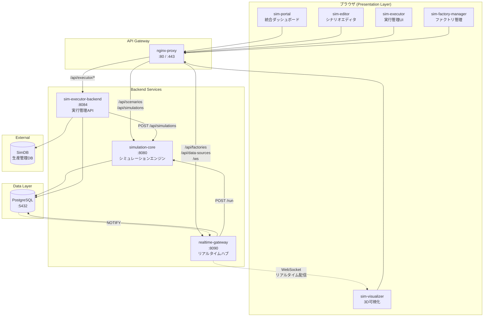

## データフロー図

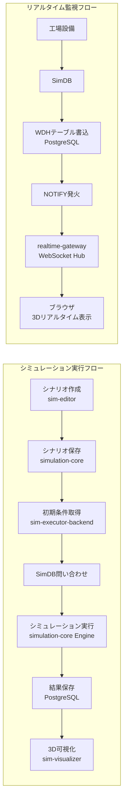

## サービス間通信図

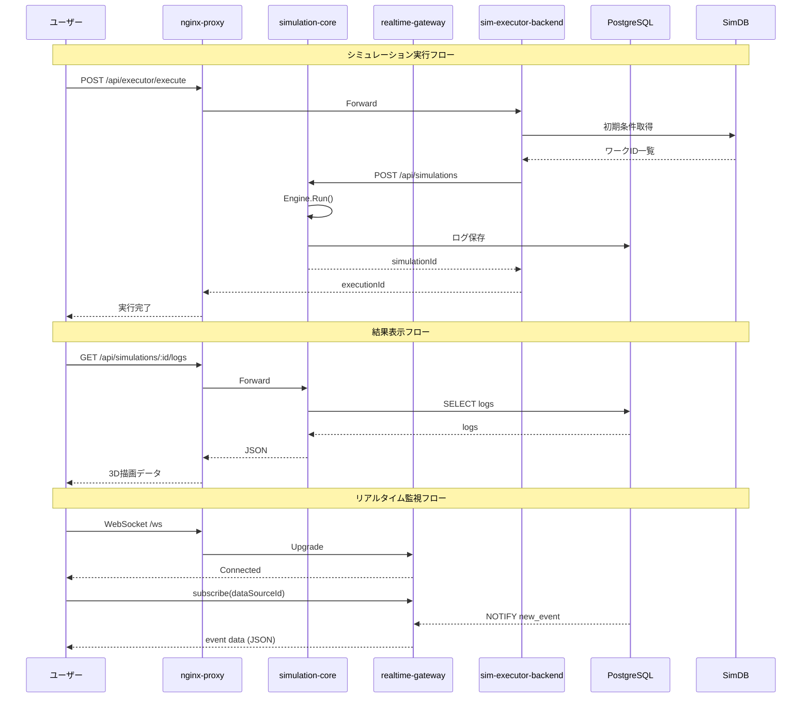

## インフラ構成図

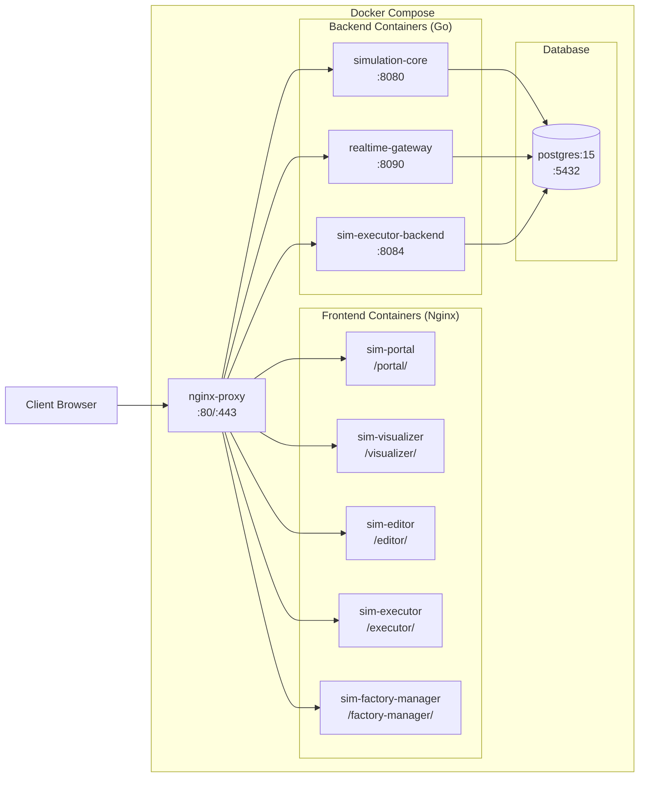

---

## クラス図

### simulation-core ドメインモデル

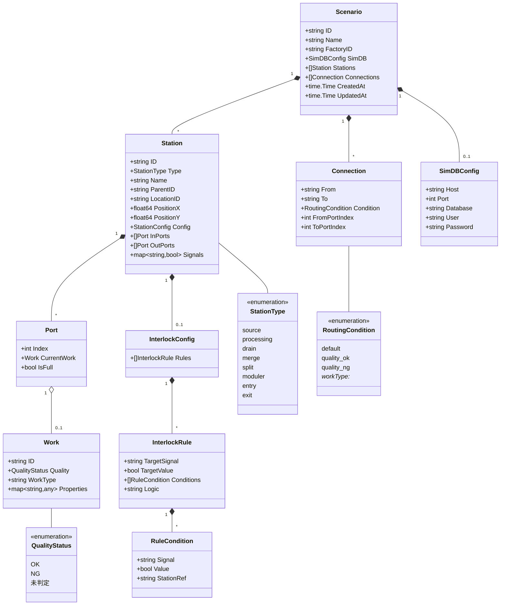

### simulation-core エンジン

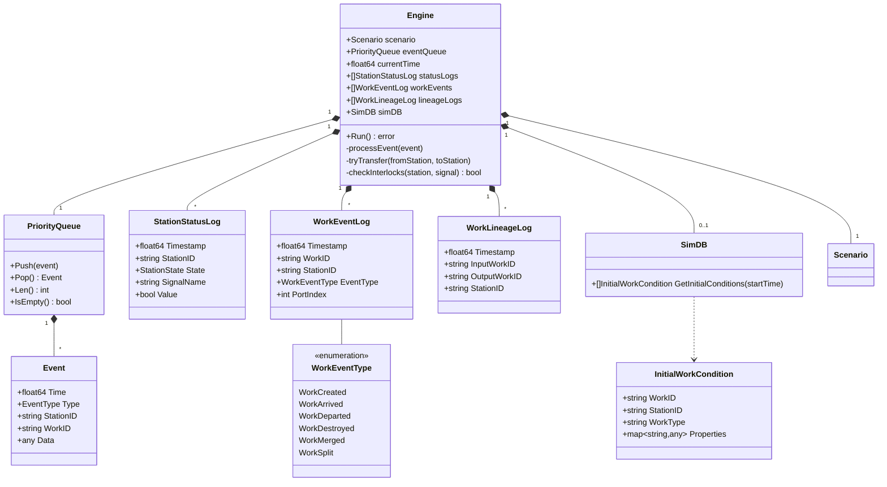

### realtime-gateway

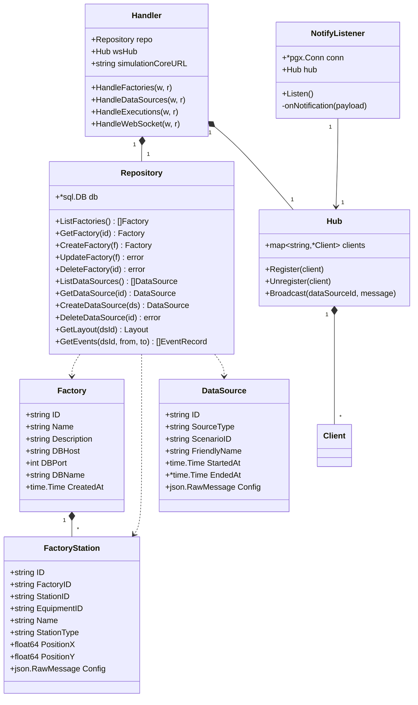

### sim-visualizer フロントエンド

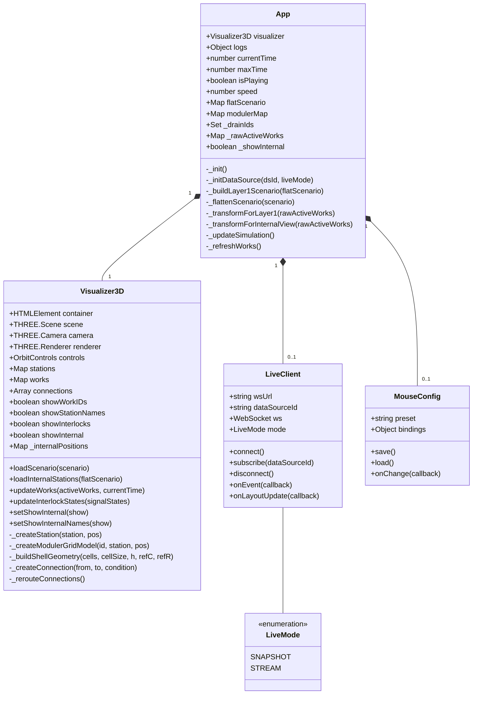

### sim-editor フロントエンド

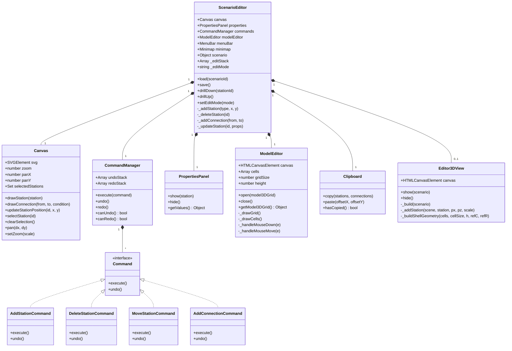

### データベーススキーマ (ER図)

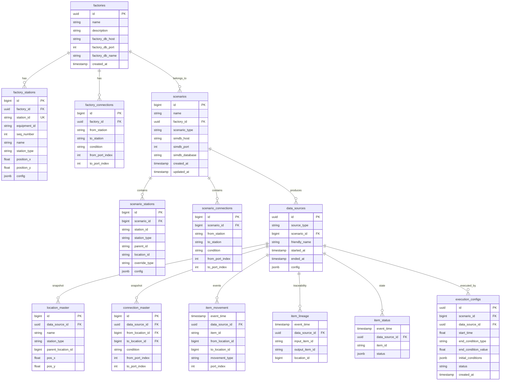

### シグナルシステム

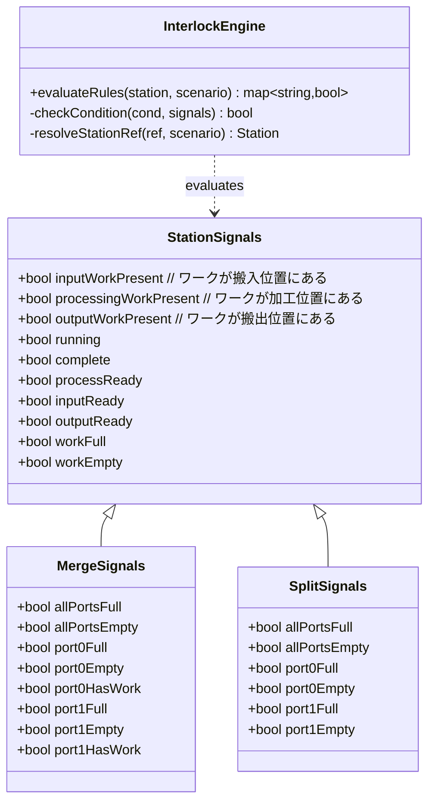
